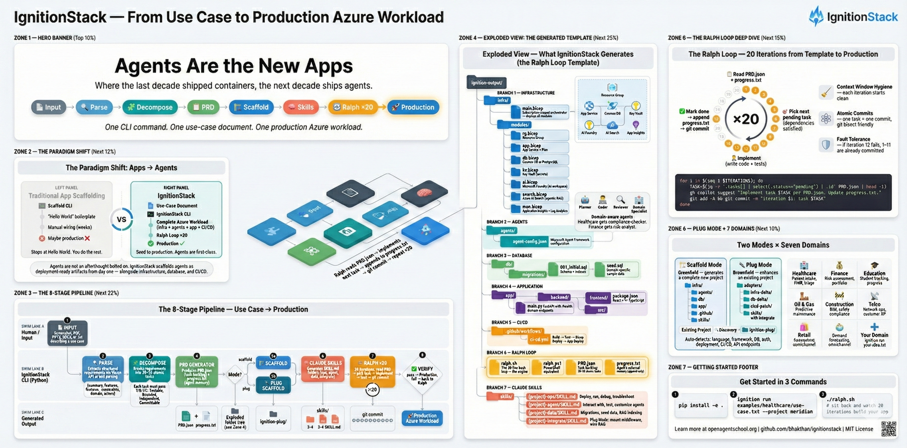
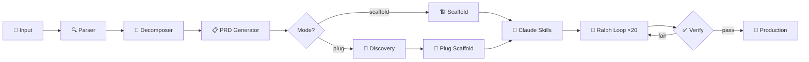

# IgnitionStack — Use Case → Production Azure Workload

> **Agents are the new apps.** Where the last decade shipped containers and microservices,
> the next decade ships agents — autonomous, goal-driven units of software that reason,
> act, and learn. IgnitionStack is how you ship them.



**Input:** Screenshot, text, PDF, PPTX, or Word doc describing a use case
**Output:** Fully deployed Azure project — Bicep infra, Microsoft Foundry agents, database, app code, GitHub repo, CI/CD pipeline
**Engine:** 20 Ralph-loop iterations using your chosen model via `gh copilot`

```
📄 Input → 🔍 Parse → 🧩 Decompose → 📋 PRD.json → 🏗️ Scaffold → 🧠 Claude Skills → 🔄 Ralph ×20 → 🚀 Production
```

---

## What's Inside

| | Question | Answer |
|---|----------|--------|
| **Why** | Why does this exist? | Traditional app scaffolders stop at "Hello World." IgnitionStack closes the gap between a napkin sketch and a production Azure workload — infrastructure, agents, database, app code, CI/CD, and 20 autonomous build iterations — in one command. |
| **What** | What does it produce? | A complete, deployable project: Bicep (or Docker Compose) infrastructure, Microsoft Foundry agent configs, SQL migrations with seed data, FastAPI + React app stubs, GitHub repo with CI/CD, and a 20-iteration Ralph loop that implements your PRD task-by-task. |
| **Where** | Where does it run? | **Azure-first** — deploys to App Service, Cosmos DB / PostgreSQL, Key Vault, AI Search, and Application Insights. **Local fallback** — add `--local` to get a Docker Compose stack with no Azure subscription required. |
| **When** | When should I use it? | Whenever you have a use-case description (text, PDF, PPTX, screenshot, or DOCX) and want to go from idea to running application without manually wiring infrastructure, agents, and pipelines. Ideal for hackathons, proofs-of-concept, and learning how agentic apps ship. |
| **Best For** | Who is it best for? | Platform engineers exploring agentic architectures, learners studying the IgnitionStack pattern from [Open Agent School](https://openagentschool.org), and teams that want a repeatable "use-case → production" pipeline they can extend for any domain. |

---

## Tech Stack

| Component | Technology | Purpose |
|-----------|------------|--------|
| Language | Python 3.11+ | CLI, pipeline orchestration, LLM calls |
| CLI Framework | Click | Command parsing, flags, help text |
| Terminal UI | Rich | Progress bars, panels, colored output, tutorial mode |
| LLM Client | OpenAI SDK (≥ 1.40) | Chat completions, Vision API, JSON mode |
| Data Models | Pydantic ≥ 2.5 | Config validation, PRD schema, task models |
| Templates | Jinja2 | Bicep, Docker Compose, app code, CI/CD generation |
| Document Parsing | PyPDF2, python-pptx, python-docx | PDF / PPTX / DOCX text extraction |
| Infrastructure | Azure Bicep / Docker Compose | Azure-first deployment or local fallback |
| Agent Framework | Microsoft Agent Framework | Domain-specific agent configuration |
| App Scaffold | FastAPI + React (Vite) | Generated backend and frontend stubs |
| CI/CD | GitHub Actions | Build → Test → Deploy workflow |
| Testing | pytest + ruff | Unit tests (124) and linting |
| Containerization | Docker | Reproducible builds and local mode |

---

## Quick Start

```bash
# 1. Install
pip install -e .

# 2. Set up credentials
cp .env.example .env
# Edit .env with your OPENAI_API_KEY, AZURE_SUBSCRIPTION_ID, etc.

# 3. Run with a sample use case
ignition run examples/healthcare/use-case.txt --project meridian-portal

# 4. Or try tutorial mode (guided, step-by-step)
ignition run examples/healthcare/use-case.txt --project meridian-portal --tutorial

# 5. Or run locally without Azure (Docker Compose fallback)
ignition run examples/finance/use-case.txt --project riskview --local
```

---

## What It Does

IgnitionStack reads your use-case document and produces a **complete, deployable project**:

```
ignition-output/
├── PRD.json                    # Prioritized task backlog (30-50 atomic tasks)
├── progress.txt                # Agent's external memory / iteration diary
├── ralph.sh                    # The core bash loop (20 iterations)
├── ralph.ps1                   # PowerShell equivalent for Windows
├── infra/
│   ├── main.bicep              # Subscription-scoped orchestrator
│   └── modules/
│       ├── rg.bicep            # Resource Group
│       ├── app.bicep           # App Service + Plan
│       ├── db.bicep            # Cosmos DB or PostgreSQL
│       ├── kv.bicep            # Key Vault
│       ├── ai.bicep            # Microsoft Foundry workspace
│       ├── search.bicep        # Azure AI Search (agentic RAG)
│       └── mon.bicep           # Application Insights + Log Analytics
├── agents/
│   └── agent-config.json       # Microsoft Agent Framework config
├── db/
│   ├── migrations/
│   │   └── 001_initial.sql     # Schema + indexes
│   └── seed.sql                # Sample data
├── app/
│   ├── backend/                # FastAPI application
│   └── frontend/               # React + Vite application
└── .github/
    └── workflows/
        └── ci-cd.yml           # Build → Test → Bicep Deploy → App Deploy
```

Then you run `ralph.sh` — it iterates 20 times, each time reading the PRD, picking the next task, implementing it, testing, and committing. By the end, you have a working application deployed to Azure.

---

## The 8 Pipeline Stages

| # | Stage | What happens |
|---|-------|-------------|
| 1 | **Input** | Accepts PPTX, PDF, screenshot, DOCX, or plain text |
| 2 | **Parse** | Extracts structured requirements via Vision API or text parsing |
| 3 | **Decompose** | Breaks requirements into 30-50 atomic tasks (Decomposition Test) |
| 4 | **PRD.json** | Produces the prioritized task backlog + initializes progress.txt |
| 5 | **Scaffold** | Generates Bicep infra, Foundry agents, DB schema, app code, CI/CD |
| 6 | **Claude Skills** | Generates SKILL.md folders per Anthropic spec (ops, agent, data, integrate) |
| 7 | **Ralph ×20** | Executes 20 iterations: read PRD → implement → test → commit |
| 8 | **Production** | Deployed Azure workload + GitHub repo + documentation |

---

## The Decomposition Test

Every task must pass 4 gates before entering the PRD:

- **T**estable — Can a type-checker or test verify it?
- **B**ounded — Can it be done in ONE iteration (<30 min)?
- **I**ndependent — Does it avoid coupling to incomplete tasks?
- **C**ommittable — Does it produce a meaningful git commit?

If a task fails any gate, split it further. Target: 30-50 tasks.

---

## Domain Examples

| Domain | Use Case | File |
|--------|----------|------|
| 🏥 Healthcare | Patient intake portal (FHIR, triage agent, lab results RAG) | `examples/healthcare/use-case.txt` |
| 💰 Finance | Portfolio risk assessment dashboard | `examples/finance/use-case.txt` |
| 🎓 Education | Student progress tracking platform | `examples/education/use-case.txt` |
| 🛢️ Oil & Gas | Equipment maintenance prediction system | `examples/oil-and-gas/use-case.txt` |
| 🚧 Construction | Smart project management with BIM and safety compliance | `examples/construction/use-case.txt` |
| 📡 Telco | Network operations and customer experience platform | `examples/telco/use-case.txt` |
| 🛍️ Retail | Intelligent omnichannel operations with demand forecasting | `examples/retail/use-case.txt` |

```bash
# Copy an example to your current directory
ignition example healthcare

# Or just point directly at it
ignition run examples/healthcare/use-case.txt --project meridian
```

---

## Tutorial Mode

Add `--tutorial` to any `ignition run` command for a guided learning experience:

- **Before each step:** explains what will happen and why
- **After each step:** shows what was generated and key files to inspect
- **Checkpoints:** quiz-style questions about the pattern ("What does T/B/I/C stand for?")
- **At the end:** learning summary + links to the full pattern on Open Agent School

```bash
ignition run examples/education/use-case.txt --project learntrack --tutorial
```

---

## Local Mode (No Azure Required)

Add `--local` to generate Docker Compose infrastructure instead of Bicep:

```bash
ignition run examples/finance/use-case.txt --project riskview --local
```

This produces `docker-compose.yml` with PostgreSQL, Redis, and application containers instead of Azure resources. Great for learning the pattern without an Azure subscription.

---

## Plug Mode (Enhance an Existing Project)

Add `--plug <path>` to integrate AI agents into an **existing** application instead of creating a new one:

```bash
# Enhance an existing FastAPI service with AI agents
ignition run use-case.txt --project my-crm --plug /path/to/existing-project

# Plug + local (Docker sidecar instead of Azure Bicep)
ignition run use-case.txt --project my-crm --plug ./existing-app --local

# Plug + tutorial (learn how integration works step by step)
ignition run use-case.txt --project my-crm --plug ./existing-app --tutorial
```

### What Plug Mode Generates

Plug Mode scans your existing project (Discovery stage) and produces **only additive artifacts** — nothing in your project is modified:

```
ignition-plug/
├── discovery.json                   # Detected stack analysis
├── PRD.json                         # Additive task backlog (integration tasks only)
├── progress.txt                     # Iteration diary
├── ralph.sh / ralph.ps1             # 20-iteration loop (scoped to plug artifacts)
├── adapters/
│   ├── agent_middleware.py           # Agent routing — mount on your existing app
│   ├── rag_connector.py             # RAG pipeline for your existing data
│   └── README.md                    # Integration instructions
├── infra-delta/
│   ├── delta.bicep                  # Incremental: AI Foundry + AI Search + Key Vault
│   └── docker-compose.override.yml  # Local: AI sidecar containers
├── db-delta/
│   └── 001_agent_state.sql          # Additive migration: conversations, messages, state
├── cicd-patch/
│   └── ai-steps.yml                # Steps to merge into existing CI/CD pipeline
└── agents/
    └── agent-config.json            # Microsoft Agent Framework config
```

### Discovery Detects

| Signal | How Detected |
|--------|-------------|
| Language | `requirements.txt`, `package.json`, `*.csproj`, `pom.xml`, `go.mod` |
| Framework | Import scanning (FastAPI, Express, ASP.NET, Spring Boot, Next.js, NestJS) |
| Database | Connection strings, ORM configs (SQLAlchemy, Prisma, EF Core, Mongoose) |
| Auth | JWT / OAuth middleware, Azure AD / MSAL / Auth0 / Firebase config |
| API surface | Route decorators from source files (auto-discovers existing endpoints) |
| Deployment | Bicep, Terraform, Docker Compose, Kubernetes manifests |
| CI/CD | GitHub Actions, Azure Pipelines, Jenkins, GitLab CI, CircleCI |

---

## Why a Bash Loop?

The Ralph Loop is intentionally simple — 30 lines of bash — because:

1. **Context Window Hygiene** — each iteration starts clean; no accumulated confusion
2. **Atomic Commits** — each iteration = exactly one git commit; you can `git bisect`
3. **Fault Tolerance** — if iteration 12 fails, 1-11 are already committed
4. **Simplicity** — no frameworks, no dependencies, no lock-in

---

## Prerequisites

- Python ≥ 3.11
- An OpenAI API key (or compatible model provider)
- For Azure deployment: Azure CLI (`az`) + active subscription
- For GitHub integration: GitHub CLI (`gh`)
- For local mode: Docker + Docker Compose

---

## Project Structure

```
ignition/
├── ignition/                        # Core Python package
│   ├── __init__.py                  # Package version (0.1.0)
│   ├── __main__.py                  # python -m ignition support
│   ├── cli.py                       # Click CLI — run, verify, example, version
│   ├── config.py                    # IgnitionConfig (Pydantic) — env + CLI flags
│   ├── llm.py                       # OpenAI SDK wrapper — chat(), chat_json()
│   ├── models.py                    # Task, PRD, ParsedRequirements, DiscoveryResult
│   ├── runner.py                    # IgnitionStackAgent — 8-stage orchestrator
│   ├── verify.py                    # Post-generation output validation (scaffold + plug)
│   ├── tutorial.py                  # Rich tutorial panels, quizzes, scoring
│   └── stages/                      # Pipeline stage implementations
│       ├── __init__.py
│       ├── input.py                 # Stage 1 — file validation & type detection
│       ├── parser.py                # Stage 2 — text extraction + LLM parsing
│       ├── decomposer.py            # Stage 3 — requirement → atomic T/B/I/C tasks
│       ├── prd.py                   # Stage 4 — PRD generation & progress init
│       ├── discovery.py             # Stage 0 (Plug Mode) — existing project scan
│       └── scaffold/                # Stage 5 — project generation
│           ├── __init__.py
│           ├── bicep.py             # Bicep infra (or Docker Compose in --local)
│           ├── agents.py            # Microsoft Agent Framework config
│           ├── database.py          # SQL migrations + seed data
│           ├── app.py               # FastAPI backend + React frontend stubs
│           ├── github.py            # git init + optional gh repo create
│           ├── cicd.py              # GitHub Actions CI/CD workflow
│           ├── ralph.py             # ralph.sh + ralph.ps1 loop scripts
│           ├── plug.py              # Plug Mode — adapters, infra-delta, db-delta
│           └── skills.py            # Claude Skills — SKILL.md generation (Anthropic spec)
├── templates/                       # Jinja2 templates for code generation
│   ├── bicep/
│   │   ├── main.bicep.j2            # Subscription-scoped orchestrator
│   │   └── modules/                 # rg, app, db, kv, ai, search, mon .bicep.j2
│   ├── docker-compose.yml.j2        # Local-mode fallback infrastructure
│   ├── app/backend/                 # main.py.j2, requirements.txt.j2, Dockerfile.j2
│   ├── db/001_initial.sql.j2        # Schema migration template
│   ├── cicd/ci-cd.yml.j2            # GitHub Actions workflow template
│   └── plug/                        # Plug Mode templates
│       ├── agent_middleware.py.j2    # Agent routing middleware
│       ├── rag_connector.py.j2      # RAG pipeline connector
│       ├── delta.bicep.j2           # Incremental Azure infrastructure
│       ├── docker-compose.override.yml.j2  # Local AI sidecar
│       ├── 001_agent_state.sql.j2   # Agent state migration
│       └── ai-steps.yml.j2          # CI/CD patch steps
│   └── skills/                      # Claude Skills templates
│       ├── ops-SKILL.md.j2          # Deploy/run/debug skill
│       ├── agent-SKILL.md.j2        # Agent interaction skill
│       ├── data-SKILL.md.j2         # Data pipeline skill
│       └── integrate-SKILL.md.j2    # Plug Mode integration guide skill
├── examples/                        # Domain use-case examples (7 domains)
│   ├── healthcare/                  # Meridian Health Network
│   ├── finance/                     # RiskView portfolio dashboard
│   ├── education/                   # LearnTrack student platform
│   ├── oil-and-gas/                 # PredictMaint equipment system
│   ├── construction/                # SiteSync project management
│   ├── telco/                       # NetPulse network operations
│   └── retail/                      # ShelfSmart retail operations
├── tests/                           # Pytest test suite
│   ├── conftest.py                  # Shared fixtures
│   ├── test_models.py               # Task & PRD model tests
│   ├── test_config.py               # Config loading tests
│   ├── test_input.py                # File detection tests
│   ├── test_parser.py               # Text extraction tests
│   ├── test_prd.py                  # PRD generation tests
│   ├── test_scaffold.py             # Scaffold output tests
│   ├── test_verify.py               # Verification logic tests
│   ├── test_cli.py                  # CLI command tests
│   ├── test_examples.py             # Domain example validation
│   ├── test_discovery.py            # Discovery stage tests
│   ├── test_plug.py                 # Plug scaffold + verify tests
│   └── test_skills.py               # Claude Skills generation tests
├── .github/workflows/ci.yml         # CI pipeline (lint + test)
├── pyproject.toml                   # Package metadata & tool config
├── requirements.txt                 # Runtime dependencies
├── requirements-dev.txt             # Dev dependencies
├── .env.example                     # Environment variable template
├── Dockerfile                       # Container build
├── CONTRIBUTING.md                  # Contribution guide
├── CHANGELOG.md                     # Release history
└── LICENSE                          # MIT
```

---

## CLI Reference

```bash
# Run the full pipeline
ignition run <input-file> --project <name> [options]

Options:
  --region TEXT       Azure region (default: eastus2)
  --model TEXT        Model name (default: gpt-4o, or IGNITION_MODEL env var)
  --iterations INT    Ralph loop iterations (default: 20)
  --work-dir PATH     Output directory (default: ./ignition-output)
  --local             Generate Docker Compose instead of Bicep
  --plug PATH         Existing project directory to enhance (Plug Mode)
  --tutorial          Step-by-step guided mode with explanations
  --verbose           Show detailed LLM prompts and responses

# Verify a generated project
ignition verify <work-dir>

# Copy a domain example to current directory
ignition example <domain>   # healthcare | finance | education | oil-and-gas | construction | telco | retail

# Print version
ignition version
```

---

## Architecture



---

## Learn More

This template implements the **IgnitionStack Agent** pattern from [Open Agent School](https://openagentschool.org).

The pattern is part of the "Agents are the new apps" paradigm — agents are first-class deployment artifacts, not afterthoughts bolted on to traditional apps.

---

## Contributing

See [CONTRIBUTING.md](CONTRIBUTING.md) for how to add domain examples, extend templates, or improve the pipeline.

## License

MIT — see [LICENSE](LICENSE).
